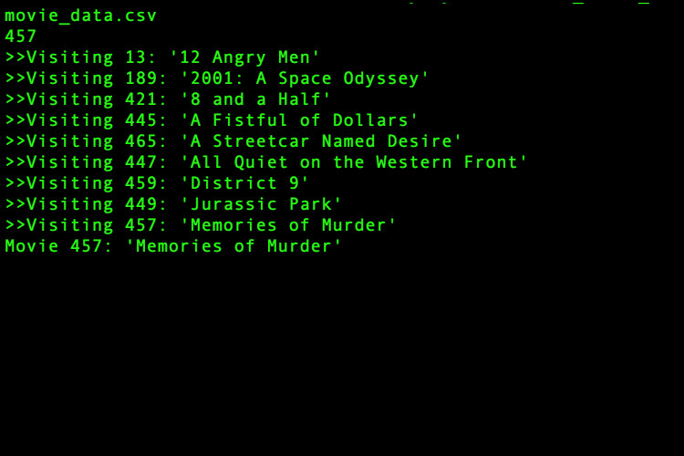
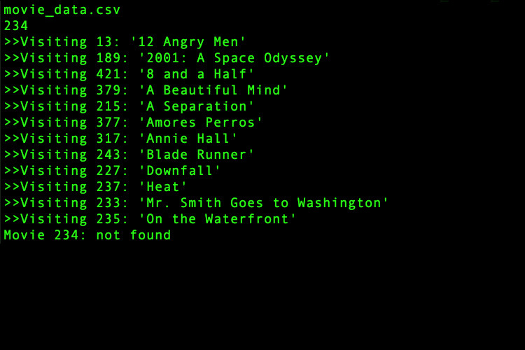

# search-movie-bst
Search movie data stored in BST
***
Created by Alex Viznytsya, Spring 2017

## Project description:

This program takes input as Netflix movie data, store the data in a binary search tree (using the movie id as the key), and then search for a movie id entered by the user. As the program visits nodes during the search, the movie id and name stored in each node is output. The program then outputs the movie id and name if found in the tree, otherwise a “not found” message is output.

The screenshots below depict two runs of the program. In the first run, the user is specifying the program to input from the file “movie_data.csv”, and to search for movie 457. The program outputs the movies that are visited during the search, and then finds the movie and outputs both the id and the name. In the second run, the user inputs the same data, and searches for movie 234, which is not found.

## CSV data file stucture:

| MovieID | MovieName | PubYear |
|---------|:---------:|:-------:|
| 13      | 12 Angry Men | 1957 |
| 189     | 2001: A Space Odyssey | 1968 |
| ...     | ...       | ...     |

